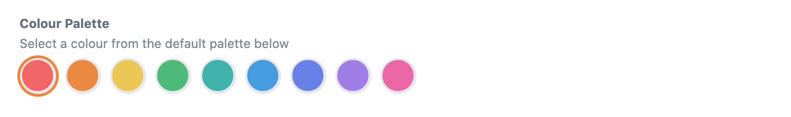
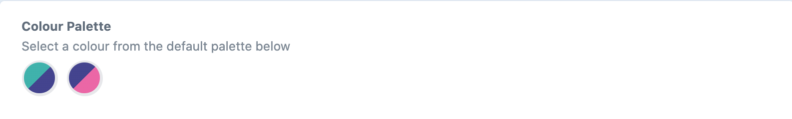
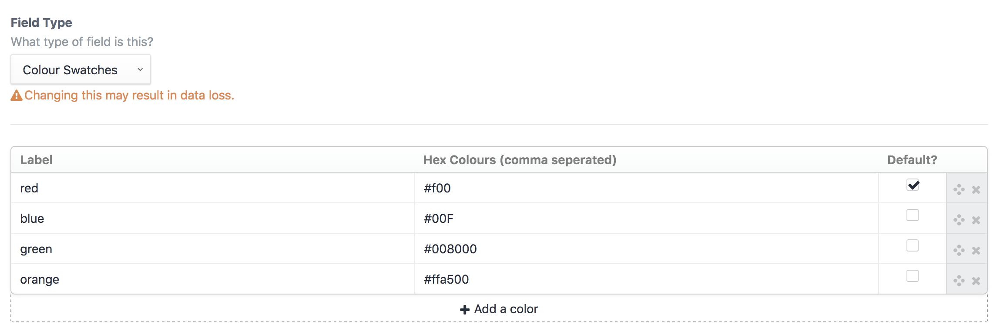
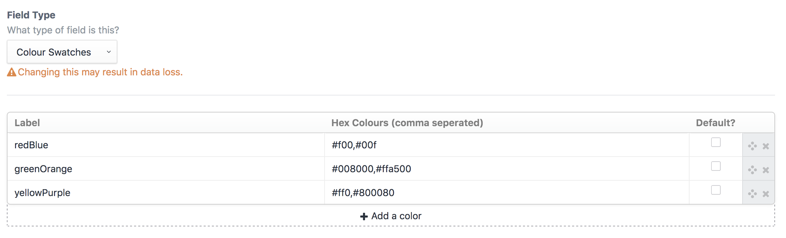
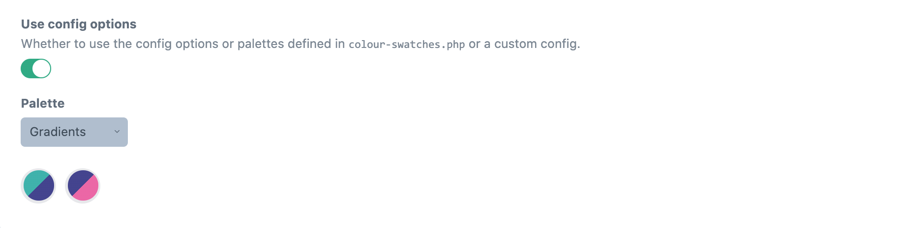

# Colour Swatches plugin for Craft CMS 3.x

Let clients choose from a predefined set of colours.




## Requirements

This plugin requires Craft CMS 3.0.0-beta.23 or later.

## Installation

To install the plugin, follow these instructions.

1. Open your terminal and go to your Craft project:

        cd /path/to/project

2. Then tell Composer to load the plugin:

        composer require percipioglobal/craft-colour-swatches

3. In the Control Panel, go to Settings → Plugins and click the “Install” button for Colour Swatches.

## Colour Swatches Overview

Instead of providing a user a full color picker, Color Swatches gives an admin the ability to provide a selection of colors for a user to choose from.

## Configuring Colour Swatches

Create a Color Swatches field and provide label and hex value options.



Multiple colours are possible by seperating them with a comma



## Using the config file

You can create a `config/colour-swatches.php` file to predefine the possible colours or define different palettes.
Take a look at the [config file](https://github.com/percipioglobal/craft-colour-swatches/blob/master/src/config.php) in this repo for an example.

```php
return [
    // Predefined colours, fixed options [label, colour, default (boolean)]
    'colours' => [
        [
            'label'   => 'red', 
            'color'   => '#F56565',
            'default' => true,
        ],
        [
            'label'   => 'orange',
            'color'   => '#ED8936',
            'default' => false,
        ],
        [
            'label'   => 'yellow',
            'color'   => '#ECC94B',
            'default' => false,
        ],
        [
            'label'   => 'green',
            'color'   => '#48BB78',
            'default' => false,
        ],
        [
            'label'   => 'teal',
            'color'   => '#38B2AC',
            'default' => false,
        ],
        [
            'label'   => 'blue',
            'color'   => '#4299E1',
            'default' => false,
        ],
        [
            'label'   => 'indigo',
            'color'   => '#667EEA',
            'default' => false,
        ],
        [
            'label'   => 'purple',
            'color'   => '#9F7AEA',
            'default' => false,
        ],
        [
            'label'   => 'pink',
            'color'   => '#ED64A6',
            'default' => false,
        ],
    ],

    // Custom  palettes, fixed options [label, default (boolean), colour (array(colour, customOptions)) ]
    'palettes' => [
        'Primary' => [  // custom label
            [
                'label'   => 'primary', // custom label
                'default' => false,
                'color'   =>  [
                    [
                        'color'     => '#38B2AC',  // the colour shown in the fieldtype (required)
                        'class'     => 'teal-500', // custom attribute
                        'btnClass' => 'blue-500', // custom attribute,
                    ],
                ]
            ],
            [
                'label'   => 'secondary', // custom label
                'default' => false,
                'color'   =>  [
                    [
                        'color'     => '#4299E1',   // the colour shown in the fieldtype (required)
                        'class'     => 'blue-500',  // custom attribute
                        'btnClass' => 'teal-500',  // custom attribute
                    ],
                ]
            ],
            [
                'label'   => 'tertiary', // custom label
                'default' => false,
                'color'   =>  [
                    [
                        'color'     => '#ED64A6',   // the colour shown in the fieldtype (required)
                        'class'     => 'pink-500',  // custom attribute
                        'btnClass' => 'blue-500',  // custom attribute
                    ],
                ]
            ],
        ],
        'Gradients' => [
            [
                'label'   => 'primary', 
                'default' => false,
                'color'   =>  [
                    [
                        'color'     => '#38B2AC',   // the colour shown in the fieldtype (required)
                    ],
                    [
                        'color'     => '#434190',  // the next colour in this loop
                    ],
                ]
            ],
            [
                'label'   => 'secondary', // custom label
                'default' => false,
                'color'   =>  [
                    [
                        'color'     => '#434190',   // the colour shown in the fieldtype (required)
                    ],
                    [
                        'color'     => '#ED64A6',  // the next colour in this loop
                    ],
                ]
            ],
        ],
    ],
];
```

In your field settings you can then have the possibility to have it use the predefined colours.




## Using Colour Swatches

You can access both the label and color in your template. By default, the label will display:

```twig
{{ fieldName }}
{{ fieldName.label }}
{{ fieldName.labels }} {# Returns an array of all labels #}
{{ fieldName.color }}
{{ fieldName.colours }} {# Returns an array of all colours #}
```
OR to access custom attributes from the config file

```twig

    {{ field.color }}
    {{ field.CUSTOM }}

```
Based on the awesome [Craft 2 plugin](https://github.com/vigetlabs/craft-color-swatches) from Vigetlabs

Brought to you by [Percipio](https://percipio.london)
