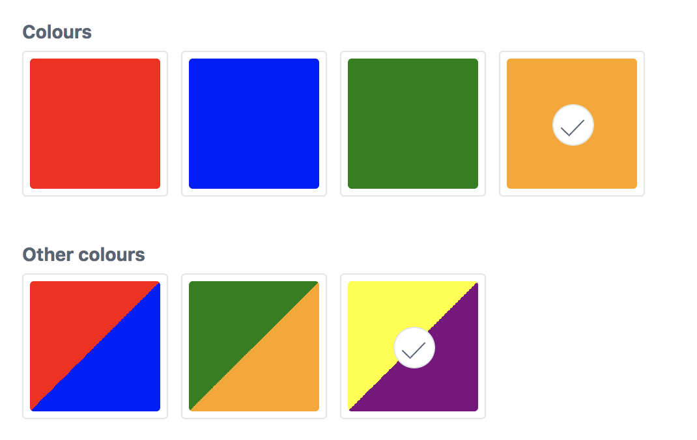
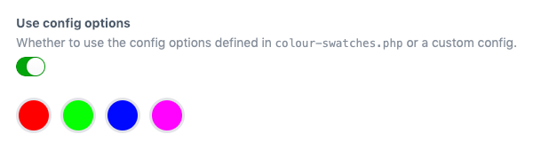

# Colour Swatches plugin for Craft CMS 3.x

Let clients choose from a predefined set of colours.



## Requirements

This plugin requires Craft CMS 3.0.0-beta.23 or later.

## Installation

To install the plugin, follow these instructions.

1. Open your terminal and go to your Craft project:

        cd /path/to/project

2. Then tell Composer to load the plugin:

        composer require percipioglobal/craft-colour-swatches

3. In the Control Panel, go to Settings → Plugins and click the “Install” button for Colour Swatches.

## Colour Swatches Overview

Instead of providing a user a full color picker, Color Swatches gives an admin the ability to provide a selection of colors for a user to choose from.

## Configuring Colour Swatches

Create a Color Swatches field and provide label and hex value options.


Multiple colours are possible by seperating them with a comma


## Using the config file

You can create a `config/colour-swatches.php` file to predefine the possible colours or define different palettes.
Take a look at the [config file](https://github.com/percipioglobal/craft-colour-swatches/blob/master/src/config.php) in this repo for an example.

```php
return [

    // Predefined colours
    'colours' => [
        [
            'label' => 'red',
            'color' => '#ff0000',
            'default' => false,
        ],
        [
            'label' => 'green',
            'color' => '#00ff00',
            'default' => false,
        ],
        [
            'label' => 'blue',
            'color' => '#0000ff',
            'default' => false,
        ],
        [
            'label' => 'pink',
            'color' => '#ff00ff',
            'default' => false,
        ]
    ],
    
    'palettes' => [
        'Red Green' => [
            [
                'label'   => 'red',
                'color'   => '#ff0000',
                'default' => false,
            ],
            [
                'label'   => 'green',
                'color'   => '#00ff00',
                'default' => false,
            ],
        ],
        'Buttons' => [
            [
                'label'   => 'blue-white',
                'color'   => '#0000ff,#ffffff',
                'default' => false,
            ],
            [
                'label'   => 'red-white',
                'color'   => '#ff0000, #ffffff',
                'default' => false,
            ],
        ],
    ],
];
```

In your field settings you can then have the possibility to have it use the predefined colours.



## Using Colour Swatches

You can access both the label and color in your template. By default, the label will display:

```twig
{{ fieldName }}
{{ fieldName.label }}
{{ fieldName.labels }} {# Returns an array of all labels #}
{{ fieldName.color }}
{{ fieldName.colours }} {# Returns an array of all colours #}
```

Based on the awesome [Craft 2 plugin](https://github.com/vigetlabs/craft-color-swatches) from Vigetlabs

Brought to you by [Percipio](https://percipio.london)
