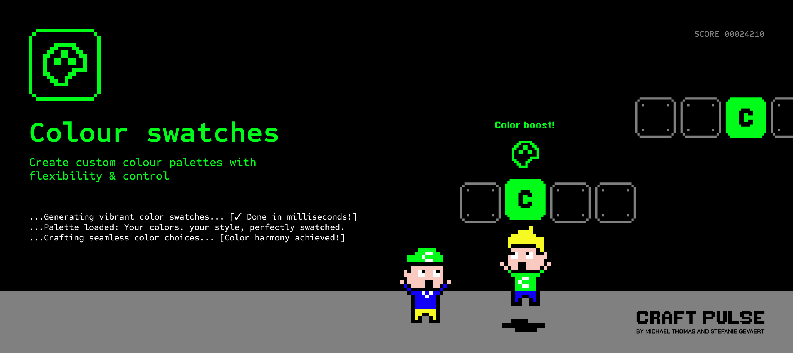
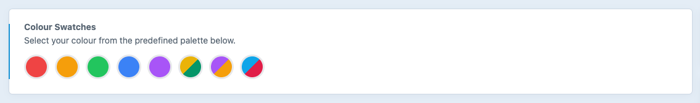
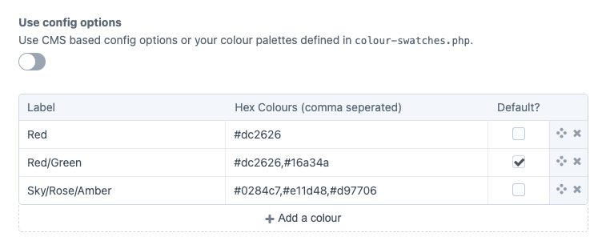
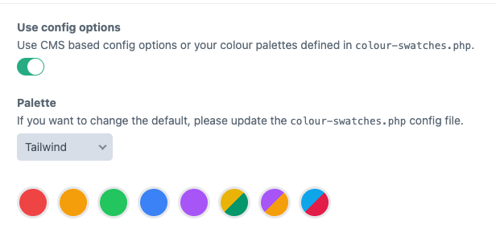

Create custom colour palettes with flexibility & control.

# Colour Swatches plugin for Craft CMS 5

Instead of giving editors a full colour picker, Colour Swatches is a configurable field type that lets you provide a curated selection of colours to choose from. Build branded colour palettes with associated CSS class names and custom attributes, ready to use in your templates and GraphQL queries.



## Requirements

- Craft CMS 5.0.0 or later
- PHP 8.2 or later

Looking for the Craft 4 version? Use the [`v4` branch](https://github.com/craftpulse/craft-colour-swatches/tree/v4) (`craftpulse/craft-colour-swatches: ^4.0`).

## Installation

1. Open your terminal and go to your Craft project:

        cd /path/to/project

2. Tell Composer to load the plugin:

        composer require craftpulse/craft-colour-swatches

3. In the Control Panel, go to Settings → Plugins and click the "Install" button for Colour Swatches.

## Upgrading from 5.1.0

Version 5.2.0 introduces stable handles on stored swatch values, so palette labels can be renamed without existing selections losing their value. The upgrade runs automatically:

- A migration queues batched resave jobs for every element type that uses a Colour Swatches field.
- Once the queue has processed them, all stored values carry a handle and are indexed for search.
- On deployments, `php craft up` applies the migration; make sure a queue runner processes the queued jobs afterwards.

Also note the GraphQL changes in 5.2.0, covered in the [GraphQL](#graphql) section below. They are breaking if you query swatch fields.

## Configuring Colour Swatches

### Using the field settings

Create a Colour Swatches field and provide a label, hex value, optional default, and an optional CSS class per option. Multiple colours are possible by separating them with a comma, which renders as a gradient swatch.



You can access the label, colour, and class in your template. By default, the label will display:

```twig
    {{ fieldName }}
    {{ fieldName.label }}
    {{ fieldName.color }}
    {{ fieldName.class }}
```

```twig
    
        {{ color.color }}
    
```

If you want more granular control over your colour palettes, use the configuration file option below.

### Using the config file

You can use a `config/colour-swatches.php` config file to predefine the possible colours, define different palettes, and add labels, class names, or any custom attributes to your colours.

Take a look at the [config file](https://github.com/craftpulse/craft-colour-swatches/blob/v5/src/config.php) in this repo for a full example.

```php
return [

    // Custom palettes, fixed options [label, handle, default (boolean), class, colour (array(colour, customOptions))]
    'palettes' => [
        'Tailwind' => [  // palette name (required)
            [
                'label'   => 'Red',   // shown to editors (required)
                'handle'  => 'red',   // stable identifier (optional, recommended)
                'default' => true,    // whether this option is preselected
                'class'   => null,    // extra classes to go along with this palette
                'color'   => [
                    [
                        'color'           => '#ef4444',            // the colour shown in the field (required)
                        'background'      => 'bg-red-500',         // optional / custom attribute
                        'backgroundHover' => 'hover:bg-red-700',   // optional / custom attribute
                        'text'            => 'text-white',         // optional / custom attribute
                        'textHover'       => 'hover:text-zinc-200' // optional / custom attribute
                    ],
                ],
            ],
            [
                'label'   => 'Sunset',
                'handle'  => 'sunset',
                'default' => false,
                'class'   => 'bg-sunset',
                'color'   => [
                    // multiple colours render as a gradient swatch
                    ['color' => '#f59e0b'],
                    ['color' => '#ef4444'],
                ],
            ],
        ],
    ],

    // Fallback colours used when a field has "Use config options" enabled
    // but no palette selected
    'colors' => [
        [
            'label'   => 'Green',
            'handle'  => 'green',
            'default' => false,
            'class'   => null,
            'color'   => [
                ['color' => '#22c55e'],
            ],
        ],
    ],

];
```

In your field settings you then have the option to use the predefined palettes.



#### Making changes to your config file

Stored swatch values are enriched from your config on save. If you change colours, classes, or custom attributes in the config file, resave your entries so the stored data picks up the changes:

```bash
php craft resave/entries
```

#### Using Colour Swatches

You can access the label, colour, class, and any custom attributes in your template. By default, the label will display:

```twig
    {{ fieldName }}
    {{ fieldName.label }}
    {{ fieldName.color }}
    {{ fieldName.class }}
```

If you're using multiple colours you will need to loop through your colour array:

```twig
    
        {{ color.color }}
        {{ color.customAttribute }}
    
```

#### Using Collections

The `collection()` method (added in 5.1.0) returns a recursive Laravel collection for easier manipulation:

```twig
{# Get all hex values as an array #}


{# Filter colours by a custom attribute #}


{# Chain multiple operations #}


{# Create a CSS gradient from the colours #}

<div style="background: {{ gradient }}">Gradient background</div>
```

## Changing Labels

Swatch values are matched by a stable handle first, then by label as a fallback for values saved before 5.2.0. This means you can rename labels in your config file or field settings without existing selections losing their value.

### How handles work

When an entry is saved, a handle is generated from the label (camelCase) and stored with the value:

- "Red" → handle: `red`
- "Primary Red" → handle: `primaryRed`
- "Sky Blue" → handle: `skyBlue`

The handle is used internally for matching. It is available in GraphQL if you need it, but you'll usually only work with the label, colour, and class.

### Handle priority

1. **Explicit `handle` in the config** is always used if present (allows intentional handle changes)
2. **Existing handle stored with the value** is preserved for stability
3. **Auto-generated from the label** on first save

For guaranteed stability, add explicit `handle` keys to your config entries (see the example above). If you rename a *handle* in your config, run `php craft resave/entries` afterwards so stored values are re-matched.

## Searching

As of 5.2.0, Colour Swatches values are indexed by Craft search. When the field is marked as searchable in its field layout, entries can be found by swatch label, handle, CSS class, or colour value:

```twig

```

## GraphQL

Swatch fields resolve to a shared `ColourSwatches_SwatchData` type:

```graphql
fieldName {
    label
    handle
    class
    color
}
```

which returns:

```json
"fieldName": {
    "label": "Sunset",
    "handle": "sunset",
    "class": "bg-sunset",
    "color": [
        { "color": "#f59e0b" },
        { "color": "#ef4444" }
    ]
}
```

### GraphQL Mode

Each field has a **GraphQL Mode** setting (shown when GraphQL is enabled) with two options:

- **Full data** (default): returns the `ColourSwatches_SwatchData` object shown above
- **Label only**: returns the label as a plain string, matching the pre-1.7 behaviour

```graphql
# with "Label only" mode
fieldName  # "Sunset"
```

### Upgrading GraphQL queries to 5.2.0

Two breaking changes if you upgrade from an earlier version:

- The per-field-handle type names were replaced by the single shared `ColourSwatches_SwatchData` type. Update any inline fragments that referenced the old type names.
- Colour values are no longer double-JSON-encoded. If your client code parsed the `color` strings manually, remove the extra parse step.

---

Brought to you by [CraftPulse](https://github.com/craftpulse)
