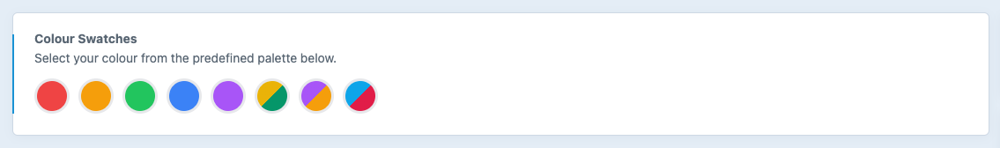

Create custom colour palettes with flexibility & control.

# Colour Swatches plugin for Craft CMS 3.5+

Instead of providing a user a full color picker, Colour Swatches is a configurable a fieldtype that gives an admin the ability to provide a selection of colours for a user to choose from. This allows you to create branded colour palettes with a bank of classnames ready to use in your templates. 



## Requirements

This plugin requires Craft CMS 3.5.0 or later.

## Installation

To install the plugin, follow these instructions.

1. Open your terminal and go to your Craft project:

        `cd /path/to/project`

2. Then tell Composer to load the plugin:

        `composer require percipioglobal/craft-colour-swatches`

3. In the Control Panel, go to Settings → Plugins and click the "Install" button for Colour Swatches.

## Configuring Colour Swatches
### Using the field settings

Create a Colour Swatches field and provide label and hex value options. Multiple colours are possible by seperating them with a comma.


#### When using Colour Swatches with the field settings

You can access both the label and color in your template. By default, the label will display:

```twig
    {{ fieldName }}
    {{ fieldName.label }}
    {{ fieldName.color }}
```

```twig
    
        {{ color.color }}
    
```

If you want more granular control with your colour palettes, use the configuration file option below.

### Using the config file

You can use a `config/colour-swatches.php` config file file to predefine the possible colours, define different palettes and add lables, classnames or other attributes to your colours.

Take a look at the [config file](https://github.com/percipioglobal/craft-colour-swatches/blob/master/src/config.php) in this repo for an example.

```php
return [

    // Custom  palettes, fixed options [label, default (boolean), colour (array(colour, customOptions)) ]
    'palettes' => [
        'Tailwind' => [  // custom label (required)
            [
                'label'   => 'Red', // custom label (required)
                'default' => true,  // default could be true/false (option is required)
                'color'   =>  [
                    [
                        'color'             => '#ef4444',               // the colour shown in the fieldtype (required)
                        'background'        => 'bg-red-500',            // optional / custom attribute
                        'backgroundHover'   => 'hover:bg-red-700',      // optional / custom attribute
                        'text'              => 'text-white',            // optional / custom attribute
                        'textHover'         => 'hover:text-zinc-200'    // optional / custom attribute
                    ]
                ]
            ],
            [
                'label'   => 'Amber',
                'default' => false,
                'color'   =>  [
                    [
                        'color'             => '#f59e0b',               
                        'background'        => 'bg-amber-500',
                        'backgroundHover'   => 'hover:bg-amber-700',
                        'text'              => 'text-white',
                        'textHover'         => 'hover:text-zinc-200'
                    ]
                ]
            ],
            [
                'label'   => 'Green',
                'default' => false,
                'color'   =>  [
                    [
                        'color'             => '#22c55e',              
                        'background'        => 'bg-green-500',
                        'backgroundHover'   => 'hover:bg-green-700',
                        'text'              => 'text-white',
                        'textHover'         => 'hover:text-zinc-200'
                    ]
                ]
            ],
            [
                'label'   => 'Blue',
                'default' => false,
                'color'   =>  [
                    [
                        'color'             => '#3b82f6',              
                        'background'        => 'bg-blue-500',
                        'backgroundHover'   => 'hover:bg-blue-700',
                        'text'              => 'text-white',
                        'textHover'         => 'hover:text-zinc-200'
                    ]
                ]
            ],
            [
                'label'   => 'Purple',
                'default' => false,
                'color'   =>  [
                    [
                        'color'             => '#a855f7',              
                        'background'        => 'bg-purple-500',
                        'backgroundHover'   => 'hover:bg-purple-700',
                        'text'              => 'text-white',
                        'textHover'         => 'hover:text-zinc-200'
                    ]
                ]
            ],
            [
                'label'   => 'Yellow/Emerald',
                'default' => false,
                'color'   =>  [
                    [
                        'color'             => '#eab308',              
                        'background'        => 'bg-yellow-500',
                        'backgroundHover'   => 'hover:bg-yellow-700',
                        'text'              => 'text-white',
                        'textHover'         => 'hover:text-zinc-200'
                    ],
                    [
                        'color'             => '#059669',               
                        'background'        => 'bg-emerald-600',
                        'backgroundHover'   => 'hover:bg-emerald-800',
                        'text'              => 'text-white',
                        'textHover'         => 'hover:text-zinc-200'
                    ]
                ]
            ],
            [
                'label'   => 'Red/Amber',
                'default' => false,
                'color'   =>  [
                    [
                        'color'             => '#a855f7',              
                        'background'        => 'bg-red-500',
                        'backgroundHover'   => 'hover:bg-red-700',
                        'text'              => 'text-white',
                        'textHover'         => 'hover:text-zinc-200'
                    ],
                    [
                        'color'             => '#f59e0b',               
                        'background'        => 'bg-amber-500',
                        'backgroundHover'   => 'hover:bg-amber-700',
                        'text'              => 'text-white',
                        'textHover'         => 'hover:text-zinc-200'
                    ]
                ]
            ],
            [
                'label'   => 'Sky/Rose',
                'default' => false,
                'color'   =>  [
                    [
                        'color'             => '#0ea5e9',               
                        'background'        => 'bg-sky-500',
                        'backgroundHover'   => 'hover:bg-sky-700',
                        'text'              => 'text-white',
                        'textHover'         => 'hover:text-zinc-200'
                    ],
                    [
                        'color'             => '#e11d48',               
                        'background'        => 'bg-rose-600',
                        'backgroundHover'   => 'hover:bg-rose-800',
                        'text'              => 'text-white',
                        'textHover'         => 'hover:text-zinc-200'
                    ]
                ]
            ],
        ]
    ]

];
```

In your field settings you can then have the possibility to have it use the predefined colours.


#### Making changes to your config file

If have entries using Colour Swatches and you make changes to your config file, you will need to resave your entries for new information from your config file to be pulled into your entry data. 

From the command line you can run Crafts `./craft resave/entries` and your entries will be populated with any changes to from your `colour-swatches.php` config file. Colour swatches uses the `label` value to map changes to the entries, so make sure your labels values are unique / not null.  


#### Using Colour Swatches

You can access both the label and color in your template. By default, the label will display:

```twig
    {{ fieldName }}
    {{ fieldName.label }}
    {{ fieldName.color }}
    {{ fieldName.customAttribute }}
```

If you're using multiple colours you will need to loop through your color array

```twig
    
        {{ field.color }}
        {{ field.customAttribute }}
    
```


Brought to you by [Percipio](https://percipio.london)